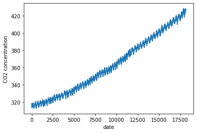
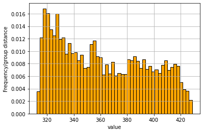
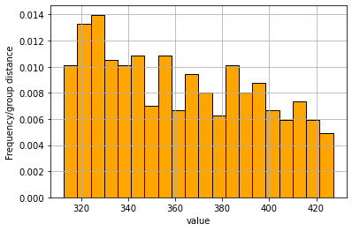
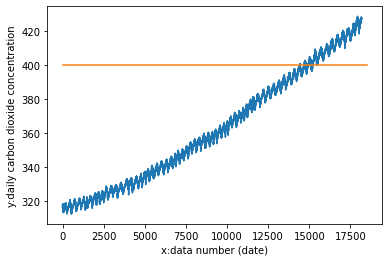
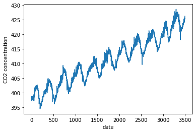
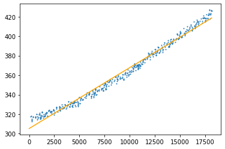

# Carbon Dioxide Concentration Analysis

In our project, we use a dataset of **the daily carbon dioxide concentration data from Mar 30, 1958 to Mar 3, 2025 at Mauna Loa, Hawaii** from https://github.com/datasets/co2-ppm-daily/tree/main, which contains Atmospheric Carbon Dioxide Dry Air Mole Fractions from quasi-continuous daily measurements at Mauna Loa, Hawaii.


```python
import pandas as pd
data = pd.read_csv("./co2-ppm-daily.csv")
print(data)
```

                 date   value
    0      1958-03-30  316.16
    1      1958-03-31  316.69
    2      1958-04-02  317.67
    3      1958-04-03  317.76
    4      1958-04-04  317.09
    ...           ...     ...
    18174  2025-02-25  426.71
    18175  2025-02-26  426.71
    18176  2025-03-01  426.64
    18177  2025-03-02  426.97
    18178  2025-03-03  427.38
    
    [18179 rows x 2 columns]
    

## Outline

This dataset has 18,179 data points available for analysis, and we will analyse this data from these steps:
1. Have a brief overview on the whole dataset;
2. Randomly selecting 500 samples for sampling analysis by performing parameter estimation, including:
  - Population mean
  - Population variance
  - Population proportion
3. Perform hypothesis testing on sample data, including:
  - Population proportion
  - Population correlation coefficient
4. Calculate some relavent probabilities to determine the hidden relationship between daily carbon dioxide concentration in Hawaii and the tourism;
5. Perform linear regression on the data and apply our regression model into some real problems.
6. Draw a conclusion and show a summary of our data analysis report.


## Overview

We draw two charts according to the dataset:

#### Line Chart


```python
import matplotlib.pyplot as plt
y = list(data["value"])
x = [i for i in range(len(y))]
plt.xlabel("date")
plt.ylabel("CO2 concentration")
plt.plot(x, y)
plt.show()
```


    

    


In this line chart, we can get following information:
- The data fluctuated locally, but the overall trend was upward
- The data **dispersion** is large, therefore, we can infer that the **variance** of the data is relatively large.


### Density Histogram


```python
import matplotlib.pyplot as plt
from scipy.stats import norm
column_name = "value"
data["value"].hist(bins=50, color='orange', edgecolor='black', density=True)
plt.xlabel(column_name)
plt.ylabel('Frequency/group distance')
plt.grid(True)
plt.show()
```


    

    


In this density historgram, we can get following information:

1. There is no special pattern in data distribution；
2. The left side is higher than the right side, which means the data is **skew to the right**, therefore, we can infer that the **mean** is greater than the **median**.


## Sampling Analysis and Parameter Estimation

Due the large amount of data, we randomly sampled 500 data for analysis.


```python
# sampling and draw the sample density histogram
import random as rd
# random_date = rd.sample(list(data["date"]), k=500)
# This is randomly generated data, and it is fixed for convenience.
random_date = ['2018-10-23', '2009-12-13', '1971-01-29', '2009-05-23', '2024-05-30', '1959-10-29', '1964-12-01', '2003-07-21', '2020-08-14', '1981-03-01', '2011-02-19', '2014-12-06', '1992-01-23', '2011-05-21', '2022-11-09', '1973-01-21', '1974-10-31', '2022-01-15', '1991-04-08', '2006-12-03', '1986-03-13', '2020-11-10', '1959-10-14', '1988-04-21', '2000-11-25', '2005-01-05', '2013-03-12', '2005-02-19', '2006-10-24', '2002-08-31', '1991-01-28', '2011-12-23', '2007-07-29', '1999-04-23', '2020-07-01', '1965-01-31', '1967-03-09', '1975-07-25', '1987-06-21', '1984-02-16', '1975-06-20', '1974-07-08', '1965-01-07', '2011-10-10', '2017-07-24', '2012-08-13', '1999-01-25', '1959-10-10', '1972-02-23', '2016-12-06', '1980-03-26', '2003-01-24', '1997-02-11', '1999-07-26', '2011-11-21', '2023-10-07', '2003-02-01', '1973-09-17', '2012-07-09', '1999-07-12', '2001-08-10', '1960-12-22', '2001-11-30', '2021-06-30', '1987-05-21', '1993-12-19', '1991-06-07', '2022-04-25', '2019-08-05', '1977-12-25', '1970-07-27', '2019-12-14', '2013-01-26', '2006-01-20', '2022-09-07', '1986-10-11', '2000-01-10', '2018-11-06', '2017-12-06', '2020-10-06', '1972-06-19', '1977-10-17', '1968-03-14', '1961-12-04', '2020-07-15', '1974-04-13', '1963-12-04', '1983-05-12', '1974-07-18', '1997-01-27', '1992-01-13', '2022-03-03', '2023-02-28', '1962-09-13', '2010-04-05', '2016-05-12', '1988-02-19', '2020-07-14', '2000-10-18', '2011-11-07', '1977-05-10', '1974-02-05', '1989-05-14', '1990-12-17', '1967-02-09', '2015-04-13', '2024-01-31', '2001-01-27', '1975-06-29', '1978-02-14', '2011-09-15', '1965-03-27', '1974-02-16', '1973-02-26', '1986-10-12', '1959-04-16', '1981-11-18', '2018-11-13', '1994-09-26', '2016-10-18', '1976-10-22', '2023-12-20', '1992-05-02', '1973-03-01', '1974-04-07', '2025-02-02', '1989-05-06', '1996-09-13', '2022-07-09', '2019-11-20', '1969-11-11', '2002-01-25', '2007-06-02', '2007-07-30', '2010-10-12', '1983-06-05', '1985-05-01', '1990-02-18', '2015-11-21', '1996-08-20', '1965-02-14', '1984-12-10', '2007-10-05', '2007-10-06', '1961-01-16', '1993-12-07', '1987-09-01', '1965-03-18', '2000-02-22', '2012-01-22', '1987-08-29', '2008-09-02', '1975-05-07', '1994-10-25', '1970-10-11', '2013-12-23', '1982-04-21', '2011-01-26', '1965-10-21', '1975-02-11', '1963-04-29', '2018-02-21', '2022-02-19', '2006-04-28', '1995-12-19', '2011-09-11', '1998-12-23', '1980-02-02', '1978-04-20', '1981-02-28', '1961-08-12', '2017-08-17', '1989-03-01', '2000-03-21', '2024-02-13', '1995-07-02', '2000-07-23', '2003-03-24', '2002-12-26', '2006-03-18', '2015-11-07', '2014-11-07', '1991-10-03', '2000-07-15', '1963-01-28', '2007-11-25', '2020-03-10', '2005-07-29', '1987-11-24', '1961-01-24', '1997-12-16', '1987-01-25', '2000-08-02', '1973-11-06', '1996-11-13', '1983-12-31', '2005-09-25', '1992-04-23', '1973-04-29', '2009-11-04', '2017-04-07', '2009-10-06', '1985-12-21', '2015-06-01', '2003-03-21', '1986-09-20', '1977-05-25', '2021-01-30', '2002-01-18', '2009-01-09', '1962-11-19', '2009-07-27', '1983-06-01', '1976-11-15', '2005-06-24', '2003-08-28', '1962-07-01', '2013-02-22', '1999-04-09', '1961-10-19', '2018-11-29', '1961-08-27', '1998-12-28', '1971-05-12', '1970-06-22', '1962-10-27', '1978-08-15', '1993-01-31', '1964-01-12', '2014-02-15', '1977-11-10', '2003-12-15', '1962-09-17', '1981-11-23', '2001-02-23', '1998-02-15', '1981-03-09', '1982-10-15', '2006-12-23', '1994-05-15', '1984-01-07', '1976-02-16', '1962-12-14', '1972-04-28', '1994-02-13', '2018-05-20', '1981-11-10', '1976-11-28', '2006-08-03', '2015-11-01', '2025-01-20', '1962-12-16', '2008-12-08', '2012-11-06', '1974-08-22', '2000-05-01', '1983-03-11', '2019-08-31', '1997-12-01', '2001-01-06', '2014-05-17', '2022-04-29', '1998-05-16', '1983-03-31', '1964-11-03', '2022-11-03', '2013-01-11', '1986-07-29', '2015-05-10', '2000-11-03', '1967-06-29', '1968-11-22', '1975-02-25', '2011-08-25', '2011-02-05', '1959-04-28', '1980-05-12', '2008-03-30', '2010-05-20', '1963-05-24', '1963-08-14', '1999-09-22', '2008-05-15', '1970-08-05', '2022-10-07', '2007-12-29', '1987-01-12', '1976-11-02', '1970-06-13', '1968-03-22', '1966-03-31', '1972-10-14', '1988-12-31', '1996-05-26', '1989-10-05', '1969-07-21', '2008-06-28', '1986-08-07', '1993-01-26', '1981-02-13', '2012-03-20', '2024-08-27', '2014-11-19', '1978-12-07', '2009-06-22', '1962-03-20', '1974-09-07', '2006-07-30', '1999-02-24', '2024-11-08', '1970-11-24', '1969-06-21', '2023-10-30', '1973-05-17', '2001-01-12', '2008-02-14', '1995-04-17', '1962-05-07', '2005-06-15', '1981-03-30', '1966-05-18', '1973-09-21', '2019-10-07', '1984-12-07', '1972-04-18', '2023-01-16', '1993-01-11', '2001-08-04', '2015-08-11', '2012-04-08', '2008-11-11', '1999-05-05', '2001-11-23', '2015-03-12', '1985-12-31', '1971-07-04', '1995-02-18', '1966-04-13', '2016-09-30', '1968-10-12', '1988-10-30', '2005-06-30', '1965-03-04', '2002-12-10', '1980-03-04', '2004-12-14', '2008-09-21', '1961-06-03', '1997-08-24', '1965-09-22', '1968-07-05', '1970-06-19', '1983-09-09', '1978-03-10', '1976-09-22', '1989-12-14', '2013-11-11', '2020-01-03', '1977-05-24', '1983-10-27', '1983-01-17', '2005-03-09', '2007-04-29', '1968-09-23', '2011-06-01', '1983-01-07', '1960-02-29', '2008-05-30', '2019-12-16', '1987-10-02', '1971-08-18', '2021-10-25', '1982-12-02', '2012-12-04', '1965-06-30', '2004-12-12', '2000-10-14', '2014-12-05', '2016-11-15', '1971-12-22', '1987-06-19', '1979-12-20', '2014-08-15', '1976-07-10', '2012-08-07', '1986-05-19', '1967-02-08', '1988-06-21', '2015-05-31', '1998-10-31', '2007-09-21', '1988-01-02', '2019-08-10', '1982-01-08', '1998-09-30', '2010-08-15', '1996-01-22', '1969-06-25', '2024-10-15', '1959-08-25', '1998-12-09', '2016-08-10', '2016-07-20', '1987-03-22', '2011-12-05', '1983-05-14', '2013-08-30', '1975-02-28', '1976-12-18', '2014-01-25', '1992-01-09', '2015-04-25', '2000-12-16', '1973-01-22', '2011-01-31', '2024-01-26', '2018-03-03', '1987-06-01', '2025-01-11', '2015-03-19', '1967-07-28', '1996-01-31', '2024-08-31', '1982-05-14', '1992-01-10', '1992-03-19', '2021-12-05', '2002-11-15', '1973-02-22', '2022-11-25', '2019-05-17', '1972-11-28', '1989-02-26', '1979-07-30', '1960-02-16', '2011-02-25', '1999-05-13', '1969-06-29', '2007-06-29', '1987-04-29', '1987-04-26', '1981-10-12', '2008-01-13', '1967-01-10', '2000-09-30', '1965-06-26', '1961-06-02', '1962-10-09', '1983-04-15', '1994-10-09', '1979-01-06', '1968-07-29', '2005-04-07', '1966-04-22', '2006-07-01', '2014-04-06', '2024-05-14', '1982-06-24', '1987-10-29', '1974-11-16', '1987-12-08', '1970-11-07', '1963-05-08', '2018-10-11', '2016-08-25', '2020-04-15', '1999-07-16', '1983-01-24', '2017-05-17', '1967-08-25', '1995-10-19', '1982-08-03', '1972-01-09', '1975-03-07', '1994-06-10', '1991-11-11', '1976-05-29', '1989-12-07', '1995-02-28', '1975-10-05', '2012-05-15', '2014-06-22', '1985-12-22', '2010-05-25', '1993-01-17', '2022-07-08', '1981-01-12', '1975-08-24', '2000-02-15', '1991-05-28', '2023-12-23', '2005-11-21', '2018-06-26', '1983-01-26', '1989-06-20', '2001-09-21', '1963-09-17', '2016-12-31', '1962-03-09', '1982-11-05']
random_list = [list(data["value"])[list(data["date"]).index(i)] for i in random_date]
sample = pd.Series(random_list)
print(sample)
```

    0      406.97
    1      386.79
    2      327.04
    3      390.68
    4      426.70
            ...  
    495    367.59
    496    316.14
    497    405.07
    498    319.32
    499    338.59
    Length: 500, dtype: float64
    


```python
# sampling and draw the sample density histogram
sample.hist(bins=20, color='orange', edgecolor='black', density=True)
plt.xlabel(column_name)
plt.ylabel('Frequency/group distance')
plt.grid(True)
plt.show()
```


    

    


And then we can calculate sample **mean** and **variance**.


```python
x_bar = sample.mean()
s2 = sample.var()
s = s2 ** 0.5
print("Sample mean:", round(x_bar, 4))
print("Sample variance:", round(s2, 4))
print("Sample standard deviation:", round(s, 4))
```

    Sample mean: 362.9114
    Sample variance: 1043.4323
    Sample standard deviation: 32.3022
    

Therefore, we learn that: $$x̄=362.9114$$, $$S^{2}=1043.4323$$, $$S=\sqrt{S^{2}}=32.3022$$

Therefore, according to these information, we can perform **parameter estimation**.


### Parameter Estimation

##### Population Mean

Since the sample size $n=500>30$, therefore, althought the sample data is not normally distributed, we can still approximately regard $\bar{X}$ follows **normal distribution**.

As for $\bar{X}$, we know that:

$$E(\bar{X})=μ$$

$$Var(\bar{X})=\sigma_{\bar{X}}^{2}=\frac{\sigma^{2}}{n}⇒\sigma_{\bar{X}}^{2}=\sqrt{\frac{\sigma^{2}}{n}}$$

Among these parameters, $\sigma_{\bar{X}}^{2}$ is the **standard error**. Therefore:

$$\bar{X}∼N(\mu,\frac{\sigma^{2}}{n})$$

or:

$$ \frac{\bar{X}-\mu}{\sigma/\sqrt{n}}\sim N(0,1) $$

However, we do not know the exact value of $σ$, we only know $S$, therefore, we need to replace $\sigma$ with $S$ and use following formula:

$$ \frac{\bar{X}-\mu}{S/\sqrt{n}}\sim T_{\gamma} $$

Therefore, the $100(1-\alpha)\%$ confidence interval for the population mean $\mu$ is given by:

$$ \bar{X}\pm t_{(1-\alpha/2)}\frac{S}{\sqrt{n}} $$

Thus, we estimated the **population mean** strength by a $95\%$ confidence interval using the sample data:

$$ \gamma=n-1=500-1=499 $$

$$ \frac{S}{\sqrt{n}}=\frac{32.3022}{\sqrt{500}}=1.4446 $$

$$ \alpha=1-0.95=0.05 $$


```python
n = 500
alpha = 0.05
standard_error = s / (n ** 0.5)
gamma = n - 1
```

And then, we need to know the value of $t_{1-\alpha/2}$, which is the value of $t_{0.975}$ when the degree of freedom $\gamma=499$.

Therefore, using Python, we can get this value:


```python
from scipy. stats import t
t_975 = t.ppf (q=1 - alpha / 2, df=gamma)
print(round(t_975, 4))
```

    1.9647
    

Therefore:

$$ t_{0.975}=1.9647 $$

And next we can calculate the confidence interval for $\mu$:


```python
upper_mu = x_bar + t_975 * standard_error
lower_mu = x_bar - t_975 * standard_error
upper_mu = round(upper_mu, 4)
lower_mu = round(lower_mu, 4)
print([lower_mu, upper_mu])
```

    [360.0731, 365.7496]
    

This shows that we are $95\%$ confident that the interval $[360.0731,365.7496]$ contains the **population mean** $\mu$.

##### Population Variance

As for using sample variance $S^{2}$ to estimate population variance $\sigma^{2}$, it uses the similar logic. Because sample size $n$ is greater than 30, so we can know that:

$$ \frac{(n-1)S^{2}}{\sigma^{2}}\sim X_{n-1}^{2} $$

Since $𝜒^{2}$ distribution is not symmetry, the $100(1-\alpha)\%$ confidence interval for $\sigma^{2}$ is given by:

$$ \frac{(n-1)S^{2}}{𝜒_{(1-\alpha/2)}^{2}}<\sigma^{2}<\frac{(n-1)S^{2}}{𝜒_{(\alpha/2)}^{2}} $$

And in this case, the degree of freedom of $𝜒^{2}$ distribution is $\gamma=n-1=500-1=499$

Therefore, we can calculate the 95 percent confidence interval using Python:


```python
from scipy.stats import chi2
n = 500
gamma = n - 1
alpha = 1 - 0.95
chi2_025 = chi2.ppf(q=alpha / 2, df=gamma)
chi2_975 = chi2.ppf(q=1 - alpha / 2, df=gamma)
upper_sigma2 = ((n - 1) * s2) / chi2_025
lower_sigma2 = ((n - 1) * s2) / chi2_975
upper_sigma2 = round(upper_sigma2, 4)
lower_sigma2 = round(lower_sigma2, 4)
print([lower_sigma2, upper_sigma2])
```

    [925.1642, 1186.0479]
    

This shows that we are $95\%$ confident that the interval $[925.1642,1186.0479]$ contains the **population variance** $\sigma^{2}$. **Variance** can reflect the **degree of dispersion** of data. According to the interval we calculated, we found that the variance of the data is large, which means that the degree of dispersion of the data is large.

##### Population Porpotion

According to climate activist Bill McKibben and his organization 350.org, atmospheric $CO_{2}$ concentrations below **350 ppm** are considered as **good condition**.And using Python, we can get the proportion of the good condition days:


```python
count = 0
n = 500
for i in sample:
  if i < 350:
    count += 1
p_hat = count / n
print(p_hat)
```

    0.41
    

This shows that $\hat{p}=0.41$

Since $n\hat{p}=500\times0.41=205>5$ and $n(1-\hat{p})=500\times(1-0.41)=295>5$, we can learn that:

$$ \frac{\hat{p}-p}{\sqrt{\frac{p(1-p)}{n}}}\sim N(0,1) $$

Therefore, we can estimate the $100(1-\alpha)\%$ confidence interval for population proportion of good condition days with this formula:

$$ \hat{p}\pm𝓏_{(1-\alpha/2)}\sqrt{\frac{\hat{p}(1-\hat{p})}{n}} $$

Accoding to Python, we can work out the $95\%$ confidence interval for population proportion of good condition days:


```python
from scipy.stats import norm
alpha = 1 - 0.95
n = 500
z_975 = norm.ppf(q=1 - alpha / 2)
upper_p = p_hat + z_975 * (((p_hat * (1 - p_hat)) / n) ** 0.5)
lower_p = p_hat - z_975 * (((p_hat * (1 - p_hat)) / n) ** 0.5)
upper_p = round(upper_p, 4)
lower_p = round(lower_p, 4)
print([lower_p, upper_p])
```

    [0.3669, 0.4531]
    

Therefore, we can have a estimation with 95% confidence that the population porprotion of good condition days is in the interval $[0.3669,0.4531]$, which means the good days in this dataset is relatively less and the air quality in Hawaii is not very good.

### Hypothesis Testing

##### Proportion

Scientific research shows that when carbon dioxide concentration exceeds **400 ppm**, the rate of global temperature rise is likely to accelerate, posing a major threat to extreme weather, sea level rise, ecosystems and agriculture.Therefore, we regard the day that the carbon dioxide concentration exceeds 400 ppm as a **bad day**.

And then, we draw a orange line at which carbon dioxide concetration is 400 in the population line chart. After observing the chart, we easily found that the horizontal line $y=400$ in the line chart is approximately intersects with the daily carbon dioxide concentration line at about when $x=15000$.


```python
import matplotlib.pyplot as plt
y = list(data["value"])
x = [i for i in range(len(y))]
plt.xlabel("x:data number (date)")
plt.ylabel("y:daily carbon dioxide concentration")
plt.plot(x, y)
plt.plot([0, 18500], [400, 400])
plt.show()
```


    

    


We have already know the population size is $N=18179$. Therefore, According to this observation, we can easily approximately calculate the proportion of the number bad days in population:

$$ p=\frac{N-15000}{N}=\frac{18179-15000}{18179}\approx0.1749 $$

Therefore, according our estimation, we can easily propose a hypothesis that the population proportion of the bad days will not grater than 0.22, which can be expressed as follows:

$$ H_{0}:p\ge0.22 $$

$$ H_{A}:p<0.22 $$

Therefore, since $np_{0}=500\times0.22=110>5$ and $n(1-p_{0})=500\times(1-0.22)=190>5$, so the test statistic is approximately distributed as follows:

$$ \frac{\hat{p}-p_{0}}{\sqrt{\frac{p_{0}(1-p_{0})}{n}}}\sim N(0,1) $$

In this case, we can first calculate the $\hat{p}$ using Python according to the sample data:


```python
counter = 0
n = 500
for i in sample:
  if i >= 400:
    counter += 1
p_hat = counter / n
print(p_hat)
```

    0.17
    

Therefore, $\hat{p}=0.17$, which means:

$$ \frac{\hat{p}-p_{0}}{\sqrt{\frac{p_{0}(1-p_{0})}{n}}}=\frac{0.17-0.22}{\sqrt{\frac{0.5(1-0.5)}{500}}}\approx-2.2361 $$

since:

$$ H_{0}:p\ge0.22 $$

$$ H_{A}:p<0.22 $$

So we need to do a one-tail test.
Let the significance level $\alpha=0.05$, and then we can calculate the $p$-value in Python:


```python
from scipy.stats import norm
p_value = norm.cdf(-2.2361)
print(round(p_value, 5))
```

    0.01267
    

Therefore, the $p$-value here is 0.01267, which is smaller than 0.05 ($\alpha$), so we can reject $H_{0}$, which means we can conclude that the proportion of bad days in pupolation is smaller than 0.22.

##### Population Correlation Coefficient


```python
import matplotlib.pyplot as plt
y = list(data["value"])
x = [i for i in range(len(y))]
plt.xlabel("date")
plt.ylabel("CO2 concentration")
plt.plot(x, y)
plt.show()
```


    

    


This is the line chart of the population. Observing the chart, we can know that the data fluctuates greatly locally, but shows an overall upward trend. Thus, we can easily propose a hypothesis: the carbon dioxide concentration and the date are strongly positive correlated, which means:

$$ H_{0}:\rho\ge0 $$

$$ H_{A}:\rho<0 $$

Therefore, we can do a one-tail test at the $\alpha=0.05$ significant level.

First, we need to do some transformation. Instead of using date, we need to use integers to represent the date, which means that the first day in the dataset 30 March, 1958 will be represented as 0, and the last day in the dataset 3 March, 2025 will be represented as 18178.

And next, we know that:

$$ r=\frac{SS_{xy}}{SS_{xx}SS_{yy}} $$

$$ SS_{xy}=Σx_{i}y_{i}-\frac{\Sigma x_{i}\Sigma y_{i}}{n} $$

$$ SS_{xx}=\Sigma x_{i}^{2}-\frac{(\Sigma x_{i})^{2}}{n} $$

$$ SS_{yy}=\Sigma y_{i}^{2}-\frac{(\Sigma y_{i})^{2}}{n} $$

So, according to the sample data, we can get the value of $r$ first in Python:


```python
x = [list(data["date"]).index(i) for i in random_date]
y = random_list
n = 500
# plt.scatter(x, y, s=1)
# plt.show()
ssxy = sum(x[i] * y[i] for i in range(n)) - (sum(x) * sum(y)) / n
ssxx = sum(x[i] ** 2 for i in range(n)) - (sum(x) ** 2) / n
ssyy = sum(y[i] ** 2 for i in range(n)) - (sum(y) ** 2) / n
r = ssxy / ((ssxx * ssyy) ** 0.5)
print(round(r, 4))
```

    0.9921
    

Therefore, $r=0.9921$, which is close to 1 and shows the **strong positive correlation** between daily carbon dioxide concentration and the date in sample data. And next, we know that:

$$ \frac{r\sqrt{n-2}}{\sqrt{1-r^{2}}}\sim T_{\gamma} $$

$$ \gamma=n-2 $$

$$ \alpha=0.05 $$

Therefore, we can perform the one-tail test in Python:


```python
from scipy. stats import t

n = 500
alpha = 0.05
gamma = n - 2
t_x = (r * ((n - 2) ** 0.5)) / ((1 - (r ** 2)) ** 0.5)
t_95 = t.ppf(1 - alpha, gamma)
print(t_x)
print(t_95)

```

    176.71816753891235
    1.6479191388549999
    

Since $\frac{r\sqrt{n-2}}{\sqrt{1-r^{2}}}=176.7182>1.6479=t_{0.95}$, we can know the the population correlation coefficient is greater than zero (positive correlation) at a 0.05 significant level, which means that the daily carbon dioxide concentration in Hawaii will become higher in the future.

## Probability

Usually, **tourism** will have a significant effect on air quality, such as the carbon dioxide concentration. This mainly because the movement of a large number of tourists will cause more carbon dioxide emissions, such as car exhaust emissions, thereby increasing carbon dioxide concentrations.

Since our data is contains carbon dioxide concentration from Mauna Loa, Hawaii, thus it is related to tourism. And we hope to find **the influence of tourism** on carbon dioxide concentration by calculating probabilities.

Hawaii's **peak tourist season** is from **mid-December to February, March to April, June to August, and late November**, a total of about 241 days. Since this data is **only suitable for the situation in recent years**, so we extract the carbon dioxide concentration data in recent ten years, which is from 2014 to 2024.

Following Python code is the process of getting data between 2014 and 2024, and also the related line chart:


```python
# Data between 2014 and 2024
y = [list(data["value"])[i] for i in range(len(list(data["date"]))) if list(data["date"])[i][0:4] in [str(j) for j in range(2014, 2025)]]
date = [list(data["date"])[i] for i in range(len(list(data["date"]))) if list(data["date"])[i][0:4] in [str(j) for j in range(2014, 2025)]]
```


```python
import matplotlib.pyplot as plt
x = [i for i in range(len(y))]
plt.xlabel("date")
plt.ylabel("CO2 concentration")
plt.plot(x, y)
plt.show()
```


    

    


Next, we plan to evaluate the daily carbon dioxide concentration level by comparing the value with **average annual carbon dioxide concentration**, if the carbon dioxide concentration on a certain day is greater than the annual average, then we regard this day a **high carbon dioxide concentration day**, otherwise we regard it a low carbon dioxide concentration day.

Therefore, we use Python to calculate the average annual carbon dioxide concentration from 2014 to 2024:


```python
dict_data = {date[i]: y[i] for i in range(len(y))}
# print(dict_data)
means = dict()
for i in range(2014, 2025):
  counter = 0
  for j in dict_data:
    if j[0:4] == str(i):
      counter += 1
  means[i] = sum(dict_data[j] for j in dict_data if j[0:4] == str(i)) / counter
print(means)
```

    {2014: 398.7667719298246, 2015: 400.90433139534866, 2016: 404.16697604790426, 2017: 406.51040816326525, 2018: 408.51706395348833, 2019: 411.373644578313, 2020: 413.981641337386, 2021: 416.070705521472, 2022: 418.2347839506174, 2023: 420.745826446281, 2024: 424.36760135135125}
    

And then, we use Python to relabel the daily carbon dioxide concentration data with boolean values, which means the boolean value True refers to a low carbon dioxide day and False refers to a high carbon dioxide day.


```python
new_data = {i: dict_data[i] <= means[int(i[0:4])] for i in dict_data} # True is low concentration day
# print(new_data)
```

##### Tourism's impact on carbon dioxide concentrations

In order to identify the impact of tourism on daily carbon dioxide concentration in Hawaii, we need to know the We need to know whether the daily CO2 concentration is low or not in Hawaii differs during peak and off-peak tourist seasons, which means we need to calculate the **probability of a low carbon dioxide concentration day given a day in peak tourism season** and the **probability of a high carbon dioxide concentration day given a day in peak tourism season**. Therefore, we can started to calculate relavent probabilities.

First, we need to define some main events:

```Event H: a day that is in peak tourist season in Hawaii;```

```Event L: a day that is a low carbon dioxide concentration day.```

Therefore, since there are about 241 days in peak tourist season in one year, so we can learn that:

$$ P(H)=\frac{241\times10}{365\times7+366\times3}\approx0.6597 $$

Next we need to know the value of  $P(L|H)$ and $P(\bar{L}|H)$. Since the population size of the data is 3653, which is too large to calculate, therefore, we decided to randomly select 500 data to represent the population value:


```python
import random as rd
# sample_date = rd.sample(list(new_data.keys()), k=500)
# This is randomly generated data, and it is fixed for convenience.
sample_date = ['2015-02-07', '2018-04-04', '2018-01-10', '2019-11-09', '2021-06-11', '2018-04-24', '2021-07-06', '2015-05-28', '2024-11-10', '2017-04-23', '2020-10-07', '2015-03-25', '2016-03-03', '2014-03-22', '2018-03-08', '2023-11-15', '2018-12-12', '2014-01-28', '2023-04-09', '2020-02-15', '2024-07-13', '2021-01-23', '2014-10-10', '2023-10-13', '2023-03-12', '2018-11-30', '2019-06-21', '2014-10-09', '2022-01-24', '2023-04-07', '2017-08-08', '2015-08-09', '2015-04-20', '2016-01-18', '2024-02-02', '2019-04-25', '2018-08-06', '2017-06-20', '2014-01-22', '2015-11-03', '2019-10-12', '2020-04-01', '2018-01-06', '2021-06-23', '2024-03-22', '2023-04-23', '2018-07-08', '2020-05-11', '2024-11-21', '2019-06-02', '2019-04-09', '2014-03-13', '2020-02-19', '2024-10-26', '2020-08-13', '2024-07-22', '2015-06-29', '2020-10-29', '2019-07-08', '2023-12-21', '2023-01-27', '2014-03-04', '2021-02-06', '2024-07-16', '2024-07-14', '2024-10-17', '2019-06-23', '2017-08-02', '2017-02-06', '2021-10-15', '2015-08-24', '2016-01-04', '2018-12-27', '2020-10-06', '2015-04-22', '2017-01-29', '2019-04-02', '2015-04-23', '2024-06-29', '2021-02-19', '2021-08-05', '2019-07-24', '2020-01-07', '2021-09-09', '2018-06-30', '2020-11-17', '2021-10-11', '2014-12-12', '2024-10-29', '2024-09-02', '2015-04-13', '2021-08-17', '2021-02-05', '2017-10-24', '2018-12-05', '2021-11-21', '2021-01-07', '2015-04-30', '2021-08-18', '2015-06-13', '2024-01-31', '2019-03-07', '2022-01-21', '2023-07-09', '2019-02-07', '2015-12-09', '2016-06-21', '2021-05-20', '2015-06-07', '2024-06-03', '2021-06-25', '2024-09-21', '2015-11-02', '2021-01-29', '2020-02-04', '2018-10-19', '2023-08-17', '2024-08-01', '2015-12-15', '2024-11-22', '2023-09-06', '2022-01-08', '2024-08-30', '2014-11-29', '2019-10-13', '2020-09-23', '2014-02-22', '2019-11-18', '2024-08-12', '2017-07-25', '2015-07-30', '2015-10-27', '2024-08-19', '2020-08-23', '2016-02-04', '2023-10-19', '2014-07-15', '2024-08-13', '2015-12-02', '2019-07-07', '2019-11-13', '2016-07-05', '2018-10-29', '2014-05-18', '2017-09-08', '2019-05-05', '2014-06-13', '2016-09-21', '2020-10-27', '2020-06-08', '2019-12-31', '2022-01-01', '2021-01-13', '2024-04-16', '2019-07-10', '2019-08-12', '2021-10-14', '2018-12-08', '2021-12-23', '2015-01-15', '2018-07-21', '2014-02-24', '2022-05-19', '2017-11-23', '2015-06-22', '2024-05-28', '2019-04-21', '2018-03-27', '2020-10-30', '2014-04-29', '2014-07-12', '2019-05-26', '2016-08-17', '2019-06-03', '2017-10-26', '2023-05-15', '2015-09-09', '2014-06-08', '2020-09-26', '2023-02-10', '2022-10-15', '2017-05-02', '2015-06-17', '2019-06-09', '2022-04-21', '2018-03-20', '2016-03-15', '2017-06-01', '2014-12-23', '2018-01-25', '2017-12-30', '2019-02-06', '2022-11-20', '2020-08-24', '2018-03-30', '2014-06-03', '2015-05-20', '2022-02-10', '2014-03-03', '2020-12-01', '2019-03-31', '2018-10-07', '2014-10-24', '2023-07-27', '2019-10-22', '2024-11-15', '2018-01-02', '2017-03-25', '2023-07-24', '2020-10-09', '2016-05-06', '2022-09-30', '2021-03-23', '2016-07-11', '2020-01-05', '2017-01-07', '2014-11-15', '2020-03-27', '2017-11-19', '2023-10-31', '2018-10-12', '2016-07-10', '2017-08-04', '2024-02-20', '2014-09-29', '2017-10-31', '2021-04-10', '2018-11-02', '2017-02-05', '2015-03-06', '2017-04-01', '2019-01-19', '2019-08-31', '2022-09-15', '2014-07-24', '2020-12-31', '2016-10-22', '2015-02-02', '2019-10-05', '2014-03-23', '2014-06-30', '2022-11-22', '2020-05-24', '2015-05-25', '2015-01-19', '2018-10-24', '2024-01-30', '2018-10-14', '2021-05-02', '2019-03-22', '2019-01-26', '2024-01-21', '2016-08-26', '2024-06-13', '2014-04-04', '2017-03-13', '2021-06-18', '2022-02-13', '2016-11-14', '2023-12-14', '2015-12-26', '2024-08-02', '2022-10-30', '2015-03-17', '2020-04-30', '2016-01-16', '2017-04-30', '2022-07-16', '2018-11-06', '2016-04-05', '2014-06-29', '2022-05-26', '2014-11-18', '2018-10-01', '2018-10-23', '2018-12-11', '2015-07-05', '2015-04-01', '2024-11-26', '2017-01-19', '2024-10-23', '2014-12-29', '2016-08-11', '2018-12-13', '2021-06-07', '2016-06-08', '2019-03-05', '2023-03-10', '2019-02-18', '2024-05-08', '2016-12-30', '2014-04-05', '2022-08-01', '2018-06-04', '2023-03-11', '2014-10-25', '2020-10-12', '2024-05-06', '2017-08-19', '2019-03-21', '2019-03-11', '2021-06-17', '2014-03-10', '2020-12-02', '2017-10-25', '2024-12-23', '2022-01-02', '2024-10-22', '2016-06-30', '2015-05-26', '2014-11-12', '2015-10-03', '2014-11-08', '2015-03-19', '2017-11-16', '2017-01-04', '2014-10-22', '2024-01-23', '2023-10-24', '2019-11-22', '2016-12-10', '2015-12-30', '2016-11-05', '2014-11-05', '2024-01-18', '2023-05-26', '2015-11-04', '2022-04-15', '2016-10-10', '2017-01-25', '2020-04-04', '2017-04-29', '2024-02-04', '2021-06-27', '2016-05-11', '2020-06-13', '2017-06-24', '2014-11-03', '2021-03-02', '2023-10-29', '2024-03-04', '2015-05-04', '2017-05-30', '2015-03-13', '2024-12-26', '2014-01-20', '2015-09-21', '2018-05-17', '2022-02-19', '2020-11-09', '2020-04-05', '2024-05-05', '2016-09-12', '2016-05-10', '2018-08-18', '2020-12-15', '2018-12-14', '2022-03-11', '2018-06-03', '2017-10-01', '2014-02-20', '2018-08-07', '2017-07-28', '2024-09-11', '2017-07-22', '2020-11-26', '2024-03-02', '2016-05-04', '2022-09-08', '2019-09-19', '2019-04-07', '2022-11-15', '2024-01-08', '2018-04-17', '2014-12-04', '2014-11-28', '2016-03-10', '2018-12-10', '2021-02-25', '2018-12-04', '2023-11-12', '2021-10-27', '2017-09-04', '2022-01-06', '2017-07-05', '2021-06-21', '2019-05-17', '2022-01-07', '2019-12-07', '2020-09-29', '2024-02-15', '2017-05-28', '2022-06-19', '2024-09-27', '2020-03-12', '2018-12-16', '2022-10-17', '2023-06-29', '2016-01-12', '2017-10-19', '2018-05-09', '2018-07-26', '2016-08-24', '2016-02-24', '2024-07-08', '2022-10-29', '2017-04-02', '2014-01-07', '2022-08-04', '2014-08-22', '2014-09-24', '2023-01-11', '2022-03-08', '2017-03-18', '2024-08-20', '2017-04-21', '2021-10-13', '2020-07-28', '2023-05-31', '2022-08-12', '2015-06-15', '2015-03-07', '2023-10-30', '2023-01-16', '2017-09-28', '2021-01-17', '2019-02-28', '2020-07-21', '2017-04-20', '2021-02-15', '2017-12-15', '2018-06-09', '2022-08-11', '2018-06-24', '2023-12-04', '2022-06-10', '2022-11-26', '2016-03-07', '2020-10-16', '2021-09-01', '2022-06-13', '2023-02-05', '2023-10-06', '2021-03-30', '2018-04-23', '2018-10-05', '2019-11-17', '2021-09-12', '2018-10-08', '2018-10-10', '2023-06-03', '2024-09-19', '2018-09-28', '2021-02-03', '2015-01-21', '2015-07-17', '2021-03-08', '2022-05-09', '2021-08-13', '2014-08-05', '2022-11-03', '2018-11-01', '2015-07-02', '2020-09-20', '2021-02-18', '2021-05-01', '2014-04-24', '2017-12-29', '2016-01-27', '2023-02-06', '2018-06-29', '2024-10-07', '2024-10-02', '2015-08-20', '2020-06-26', '2024-09-14', '2016-08-29', '2016-01-01', '2020-04-02', '2023-04-19', '2020-04-27', '2014-06-05', '2024-07-05', '2015-03-21', '2020-01-28', '2020-08-09', '2020-05-21', '2015-12-25', '2018-07-16', '2016-02-19', '2019-09-08', '2015-08-11', '2023-10-04', '2017-02-17', '2017-01-11', '2016-11-09', '2016-11-24', '2015-04-27', '2017-11-03', '2019-05-15']
# print(sample_date)
```

We know that:

$$P(L|H)=\frac{P(L\cap H)}{P(H)}$$

and

$$P(\bar{L}|H)=\frac{P(\bar{L}\cap H)}{P(H)}$$

So according to the sample data, we can get the value of $P(L|H)$ and $P(\bar{L}|H)$ in Python:


```python
num_h = 0
num_hl = 0
num_hnl = 0
h_day = []

for i in range(15, 32):
  h_day.append("12-" + str(i))
for i in range(1, 32):
  h_day.append("01-" + str(i))
for i in range(1, 31):
  h_day.append("02-" + str(i))
for i in range(1, 32):
  h_day.append("03-" + str(i))
for i in range(1, 31):
  h_day.append("04-" + str(i))
for i in range(1, 31):
  h_day.append("06-" + str(i))
for i in range(1, 32):
  h_day.append("07-" + str(i))
for i in range(1, 32):
  h_day.append("08-" + str(i))
for i in range(21, 31):
  h_day.append("11-" + str(i))

for i in sample_date:
  if i[5:] in h_day:
    num_h += 1
  if new_data[i] and (i[5:] in h_day):
    num_hl += 1
  if (not new_data[i]) and (i[5:] in h_day):
    num_hnl += 1
p_l_given_h = num_hl / num_h
p_nl_given_h = num_hnl / num_h
print(round(p_l_given_h, 4))
print(round(p_nl_given_h, 4))
```

    0.4241
    0.5759
    

Therefore:

$$ P(L|H)=0.4241 $$

$$ P(\bar{L}|H)=0.5759 $$

This means that when it is a day in **peak tourist season**, there is a probability of 0.5759 that this day's carbon dioxide concentration is **higher** than the average annual carbon dioxide concentration, while there is only a propability of 0.4241 that this day's carbon dioxide concentration is **lower** than the average annual carbon dioxide concentration.

This shows that when Hawaii is in the **peak tourist season**, it is very likely that the carbon dioxide concentration will become **higher**, which means tourism will have a significant impact on air quality in Hawaii.

##### Analysis with Bayes' Theory

In order to further present the arguement that the tourism will make daily carbon dioxide concentration in Hawaii higher, we need to know that whether it will be a peak tourist day or not if this day's carbon dioxide concentration is lower than the average annual carbon dioxide concentration, which means we need to get the value of $P(H|\bar{L})$ and $P(\bar{H}|\bar{L})$.

Since:

$$ P(H|\bar{L})=\frac{P(H\cap\bar{L})}{P(\bar{L})} $$

$$ P(\bar{H}|\bar{L})=\frac{P(\bar{H}\cap\bar{L})}{P(\bar{L})} $$

So we need to get the value of $P(\bar{L})$ first.

We have already know that $P(H)=0.6597$, therefore, according to the **law of total propability**, we can learn that:

$$ P(L)=P(L|H)P(H)+P(L|\bar{H})P(\bar{H})=P(L|H)P(H)+P(L|\bar{H})(1-P(H)) $$

Thus, we need to get the value of $P(L|\bar{H})$ in the sample using Python.


```python
num_nh = 0
num_l_nh = 0
for i in sample_date:
  if not (i[5:] in h_day):
    num_nh += 1
  if (not (i[5:] in h_day)) and new_data[i]:
    num_l_nh += 1
p_l_given_nh = num_l_nh / num_nh
print(round(p_l_given_nh, 4))
```

    0.6341
    

Therefore, $P(L|\bar{H})=0.6341 $. And then, we can get value of $P(L)$:


```python
p_h = 0.6597
p_l = p_l_given_h * p_h + p_l_given_nh * (1 - p_h)
print(round(p_l, 4))
```

    0.4956
    

This shows that $P(L)=0.4956$, which means about 0.4956 days are high carbon dioxide concentration days.

And then, according to the **Bayes' Theory** and the **Complement Rule**, we can know that:

$$ P(H|\bar{L})=\frac{P(H\cap\bar{L})}{P(\bar{L})}=\frac{P(\bar{L}|H)P(H)}{P(\bar{L})}=\frac{P(\bar{L}|H)P(H)}{1-P(L)} $$

$$ P(\bar{H}|\bar{L})=1-P(H|\bar{L}) $$

And then, according to the **Bayes' Theory**, we can get the value of $P(H|\bar{L})$ and $P(\bar{H}|\bar{L})$ in Python:


```python
p_h_given_nl = p_nl_given_h * p_h / (1 - p_l)
p_nh_given_nl = 1 - p_h_given_nl
print(round(p_h_given_nl, 4))
print(round(p_nh_given_nl, 4))
```

    0.7531
    0.2469
    

This shows:

$$ P(H|\bar{L})=0.7531 $$

$$ P(\bar{H}|\bar{L})=0.2469 $$

This means that for a day with **high carbon dioxide concentration**, there is a 0.7531 probability that it is a **peak tourist day** and a 0.2469 probability that it is a **low tourist day**. This shows that peak tourist seasons are usually accompanied by high concentrations of carbon dioxide and high carbon dioxide concentration day is more likely to be a peak tourist day.

### Summary of Probability Analysis

In summary, after analyzing some relavent probabilities, although we cannot make sure that the tourism will directly influence daily carbon dioxide concentration in Hawaii, we can still infer that:

```Tourism can have a significant impact on daily carbon dioxide concentrations. Usually, tourist peak season will have a higher carbon dioxide concentration and a higher carbon dioxide day will be more likely to be a peak tourist day. ```

## Linear Regression

In this part, we will perform a simple linear regression to build a model and identify the potantiel trend of the daily carbon dioxide concentration in Hawaii.

As we know:

$$ \hat{y}=a+bx $$

$$ b=\frac{SS_{xy}}{SS_{xx}} $$

$$ a=\bar{y}-b\bar{x} $$

Therefore, we can get the value of $a$ and $b$ in Python:

### Build Linear Regression Model


```python
x = [list(data["date"]).index(i) for i in random_date]
y = random_list
b = ssxy / ssxx
a = sum(y) / len(y) - b * sum(x) / len(x)
print(round(b, 6))
print(round(a, 4))
```

    0.006244
    305.2181
    

Therefore:

$$ \hat{y}=305.2181+0.006244x $$

And then, we can draw the chart of sample data and the least square regression line using Python:


```python
plt.scatter(x, y, s=1)
xline = list(range(18179))
yline = [305.2181 + 0.006244 * i for i in xline]
plt.plot(xline, yline, color="orange")
plt.show()
```


    

    


In this chart, blue points are sample data and the orange line is the least square regression line. Observing the image, we can find that the straight line is consistent with the data. And then, we can calculate the coefficient of determination to examine whether our linear regression is good or not. Therefore:

$$ r^{2}=\frac{SSR}{SST}=\frac{SST-SSE}{SST}=\frac{bSS_{xy}}{SS_{yy}} $$

or:

$$ r\approx0.9921⇒ r^{2}\approx0.9921^{2} $$

So, we can use Python to get this value:


```python
r_2 = b * ssxy / ssyy
print(r_2)
```

    0.9843037437333554
    

Thus, $r^{2}=0.9843$. Since that $r^{2}\in[0,1]$ and our $r^{2}$ is pretty close to 1, therefore, we can say that our linear regression is good, which means our regression model can explain 98.43037% of total variance in the daily carbon dioxide concentration in Hawaii.

### Application of Linear Regression Model

Therefore, we can use this linear regression model to predict the future daily carbon dioxide concentration in Hawaii.

On March 15, 2021, General Secretary Xi Jinping proposed at the 9th meeting of the Central Financial and Economic Affairs Commission that China strive to achieve "carbon neutrality" by 2060. So, how about Hawaii in American? Therefore, we decided to calculate **the carbon dioxide concentration in Hawaii on Jan. 1, 2060** using our linear regression model.

First, we need to transfer the date "Jan 1, 2060" to an integer using the same rule above. Since Mar 30, 1958 this number 0, Jan 1, 2060 should be presented by 37167, which means $x=37167$. Therefore:
$$\hat{y}=305.2181+0.006244x=305.2181+0.006244\times37167\approx537.2888$$
So we can know that the **carbon dioxide concentration will be 537.2888ppm on Jan 1, 2060 in Hawaii**, which is already higher than 500 ppm.

However, research shows that when the concentration of carbon dioxide in the air exceeds **500 ppm**, it is harmful to the human body. Therefore, the air quality is poor on Jan 1, 2060. Meanwhile, we can also use the linear regression model to calculate the **when will the carbon diocide concentration exceeds 500ppm**:

$$ \hat{y}=500 $$

$$ \hat{y}=305.2181+0.006244x $$

$$ ⇓ $$

$$ x=\frac{\hat{y}-305.2181}{0.006244}=\frac{500-305.2181}{0.006244}\approx31195.0512 $$

This means that **after about 31195 days since Mar 30, 1958**, which is on about **Aug 26, 2043**, the daily carbon dioxide concentration will exceeds 500 ppm, which is harmful to human health.

## Conclusion

Through our analysis of the daily carbon dioxide concentration data from Mar 30, 1958 to Mar 3, 2025 at Mauna Loa, Hawaii, we got these following conclusions:
1. The data fluctuates greatly locally, but shows an overall upward trend.
2. Population data is skew to the right, which means the population mean is greater than the variance.
3. Population parameters:
  - Mean is in the interval of $[360.0731,365.7496]$
  - Variance is in the interval of $[925.1642,1186.0479]$, which means the degree of dispersion of the data is large.
  - Proportion of daily carbon dioxide concentration in Hawaii below 350ppm is in the interval of $[0.3669,0.4531]$, which means the air quality in Hawaii these years is not very good.
  - Proportion of daily carbon dioxide concentration in Hawaii exceeds 400ppm is smaller than 0.22
4. Relationship between daily carbon dioxide concentration in Hawaii and date:
  - Sample correlation coefficeint is 0.9921
  - Popilation correlation coefficient is greater than 0, which means daily carbon dioxide concentration and the date are positive correlated.
5. The impact of tourism to the daily carbon dioxide in Hawaii:
  - In a peak tourist season, the daily carbon dioxide concentration in Hawaii will become higher than the annual average daily carbon dioxide concentration, which means tourism will increase daily carbon dioxide concentration.
  - In a day that the carbon dioxide concentration is higher than the annual daily carbon dioxide concentration, it is more likely in the peak tourist season.
6. Linear regression analysis:
  - The relationship between date and daily carbon dioxide concentrartion in Hawaii follows such linear regression model:

  $$ \hat{y}=305.2181+0.006244x $$

  - In Aug 26, 2043, the daily carbon dioxide concentrartion in Hawaii will exceeds 500ppm
  - In Jan 1, 2060, the daily carbon dioxide concentration in Hawaii will be 537.2888ppm

**In summary, Hawaii's daily carbon dioxide concentration is at a relatively high level, and the concentration is related to the tourism industry. In addition, in the future, Hawaii's daily carbon dioxide concentration will continue to rise, which will have an impact on human health. Therefore, it is necessary to take some measures to reduce the carbon dioxide concentration.**
